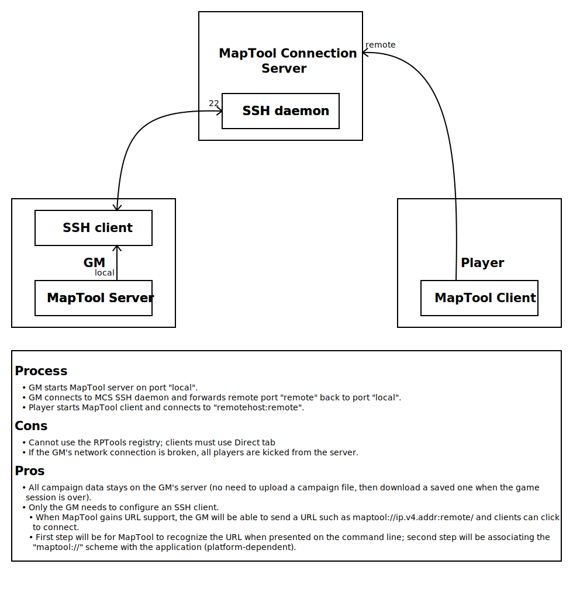

:toc:
// :sectlinks: true
:sectnumlevels: 1
:sectnums:
:short_line: pass:[____________]
:long_line: pass:[____________________________________]

= MapTool Connection Server

:source-highlighter: rouge

This document describes a technique for _MapTool_ hosts to avoid the network complexity of hosting on their person system.

The goal is to create a cloud-based _Docker_ container that acts as a relay for MapTool traffic.

Before implementing the tunnel, gather some information first:

. IP address of the cloud container: {long_line} (we'll use `1.2.3.4`)

. Port the _MapTool_ server be listening on: {short_line} (we'll use `51234`)

. Port the container will be forwarding: {short_line} (we'll use `55555`)

As shown in <<Overview>>, there are four steps.

.Overview

== Start the MapTool Connection Server

The container image is hosted on **Docker Hub**.
It can be easily imported into _Amazon Web Services_, _Microsoft Azure_, or other cloud services.

The system hosting the _MapTool_ server should upload a public key to the `maptool` user in the container to allow for simpler _SSH_ connection in the next step.
(Typically, the public key would be appended to the `~/.ssh/authorized_keys` file.
There are many sources of information for how to do this.
If your local system is _Un*x_-based, try https://www.digitalocean.com/community/tutorials/how-to-set-up-ssh-keys-on-ubuntu-20-04[this web article].)

There will be two incoming network ports that need to be open on the container: the one for the _SSH_ server (usually port 22), and whatever port clients will be connecting to (this guide uses `55555`).

== Start _SSH_ Connection to the MCS

The system hosting _MapTool_ connects to the container using _SSH_ and sets up a remote port forwarding tunnel.

Connecting to the container can be done with any _SSH_ client; _PuTTY_ is a common choice on _Windows_, while _Un*x_ systems typically have _SSH_ clients pre-installed.

When connecting to the container, specify `maptool` as the username and use the key configured in the previous step.

Configure the _SSH_ client to open port `55555` on the container and forward all connections back to port `51234` on the local system.

Sample command line:
[source,shell]
....
ssh -R 51234:0.0.0.0:55555 maptool@1.2.3.4
....

This command will continue to run for as long as you want clients to connect to your _MapTool_ server.
When _SSH_ terminates, all connected clients will be disconnected.

== Start _MapTool_ Server on the Local System

Use the chosen port number for the _MapTool_ server to start it.
Be sure to turn off **UPNP**.

This document uses `51234` for the port number, but any number greater than `5000` should be possible on all platforms (_Windows_, _Linux_, and _macOS_).

== Players Start _MapTool_ and Connect to the MCS

One or more clients connect to the container and are forwarded to the _MapTool_ server by _SSH_ automatically.

When clients connect to `1.2.3.4:55555`, they will be connected to the _SSH_ port on the container.
_SSH_ will then tunnel the packets back to the host's system where they will be delivered to port `51234`.
Since _MapTool_ is listening on that port, the client will be connected to the server.
